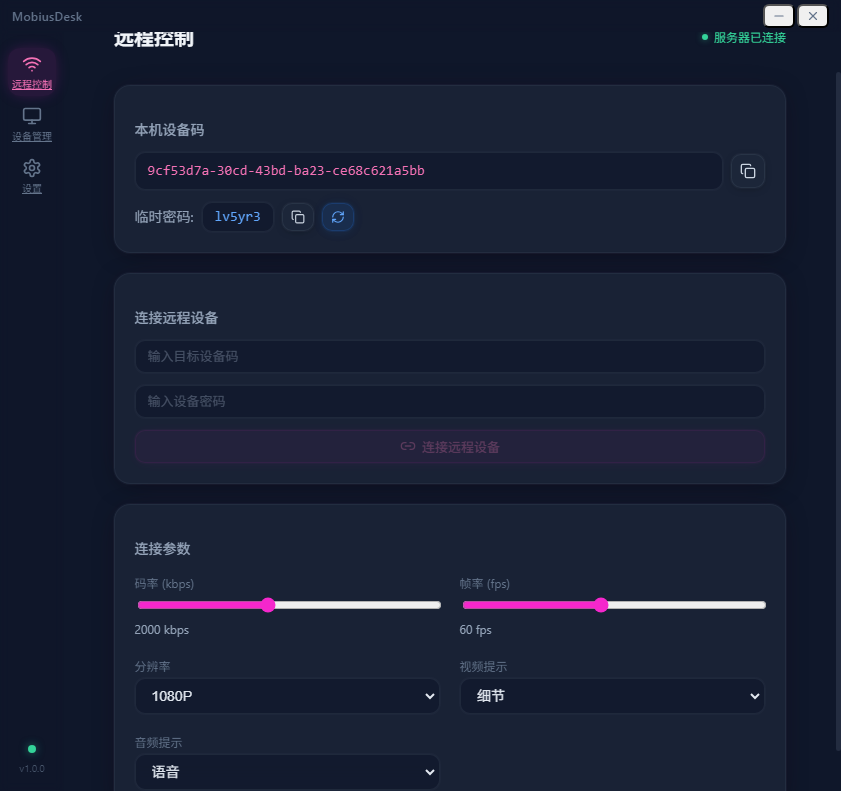
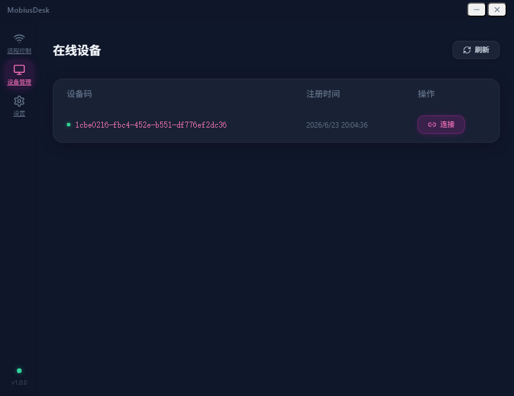
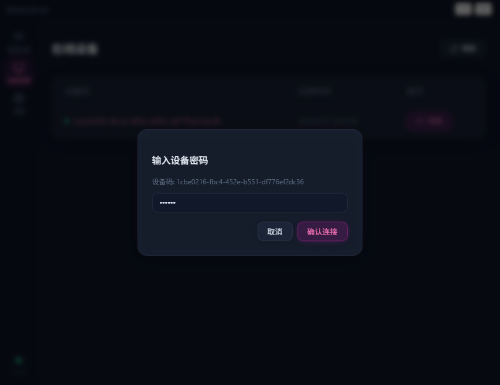
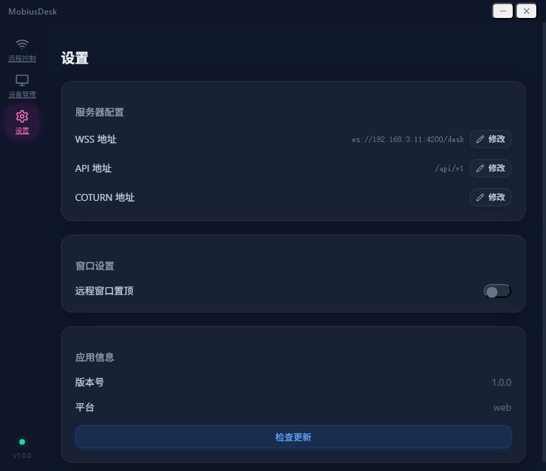
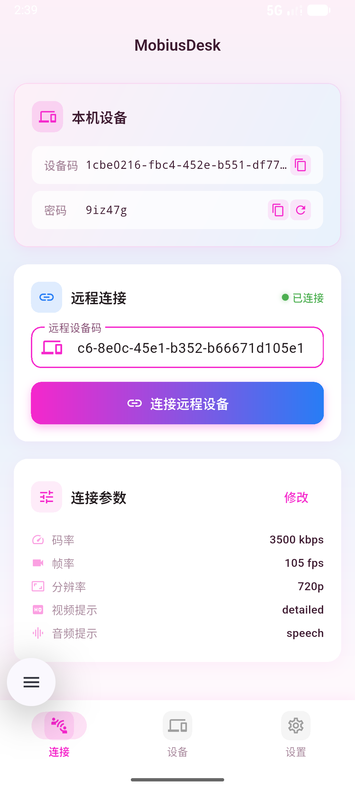
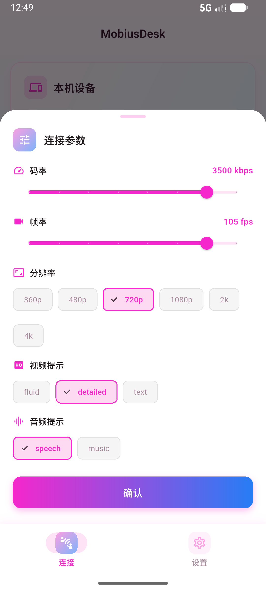
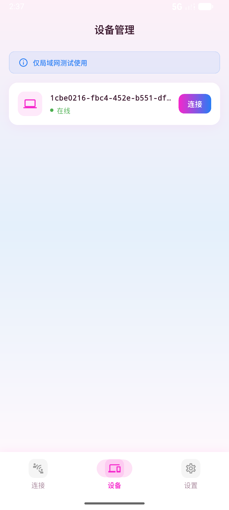
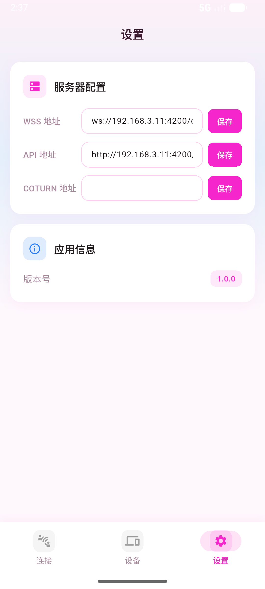

# Mobius 远程控制系统

跨平台远程桌面控制解决方案，支持 Windows、macOS、Linux 桌面端及 Android、iOS 手机端，让你随时随地远程访问和操控任何设备。

## 功能介绍

### 桌面端（MobiusDesk）

基于 React + Electron 构建，支持 Windows / macOS / Linux。

- **远程桌面查看** — WebRTC 实时画面传输，低延迟高清显示
- **键盘鼠标控制** — 完整键鼠操控，支持快捷键组合
- **控制/观看模式** — 一键切换控制与只读模式
- **屏幕捕获（被控）** — Electron desktopCapturer 捕获屏幕
- **键鼠仿真（被控）** — nut-js 执行操作指令
- **连接参数配置** — 码率/帧率/分辨率/内容提示
- **实时参数调整** — 连接中动态调整编码参数
- **连接详情面板** — 延迟/丢包率/分辨率/帧率实时显示
- **自定义服务器** — WSS/API/COTURN 地址可配置
- **来电请求弹窗** — 被控端收到连接请求时弹窗确认
- **版本更新检查** — 自动检查新版本

### 手机端（MobiusDesk Flutter）

基于 Flutter 构建，支持 Android / iOS。

- **远程桌面查看** — flutter_webrtc 渲染远程画面
- **触摸操作映射** — 单指点击=左键、长按=右键、滑动=滚轮
- **虚拟键盘输入** — 触屏发送键盘操作
- **控制/观看模式** — 切换控制与只读模式
- **连接参数配置** — 码率/帧率/分辨率配置
- **自适应画质** — 根据网络自动调整
- **设备管理** — 设备列表与快速连接

### 服务端（MobiusDesk Service）

基于 NestJS 构建，提供 API 和信令服务。

- **设备管理** — 注册/认证/在线状态
- **信令转发** — WebRTC Offer/Answer/Candidate 转发
- **连接协商** — 远程连接验证与转发
- **行为转发** — 鼠标/键盘操作实时转发
- **用户认证** — JWT Token 认证
- **版本管理** — 客户端版本检查与更新提示
- **COTURN 配置** — NAT 穿透配置下发

## 截图预览

### 桌面端

<p align="center">
  
  
</p>
<p align="center">
  
  
</p>

### 手机端

<p align="center">
  
  
  
  
</p>

## 快速开始

### 桌面端

```bash
cd mobius_desk
pnpm install
pnpm dev
```

详细说明：[开发者文档 →](docs/mobius_desk_doc/developer-guide.md)

### 手机端

```bash
cd mobius_desk_flutter
flutter pub get
flutter run
```

详细说明：[开发者文档 →](docs/mobius_desk_flutter_doc/developer-guide.md)

### 服务端

```bash
cd mobius_desk_service
pnpm install

# 启动基础设施
cd docker && docker compose up -d && cd ..

# 配置环境变量
cp .env.example .env

# 启动服务
pnpm start:dev
```

详细说明：[开发者文档 →](docs/mobius_desk_service_doc/developer-guide.md)

## 项目结构

```
remote-control/
├── mobius_desk/              # 桌面端 (React + Electron)
├── mobius_desk_flutter/      # 手机端 (Flutter)
├── mobius_desk_service/      # 服务端 (NestJS)
├── mobius_www/               # 官方网站 (Astro)
└── docs/                     # 项目文档
    ├── mobius_desk_doc/      # 桌面端文档
    ├── mobius_desk_flutter_doc/  # 手机端文档
    └── mobius_desk_service_doc/  # 服务端文档
```

## 文档导航

| 子项目 | 需求文档 | 设计文档 | 开发者文档 |
|--------|----------|----------|------------|
| 桌面端 | [产品需求](docs/mobius_desk_doc/product-requirements.md) | [项目设计](docs/mobius_desk_doc/design.md) | [开发指南](docs/mobius_desk_doc/developer-guide.md) |
| 手机端 | [产品需求](docs/mobius_desk_flutter_doc/product-requirements.md) | [项目设计](docs/mobius_desk_flutter_doc/design.md) | [开发指南](docs/mobius_desk_flutter_doc/developer-guide.md) |
| 服务端 | [架构与存储](docs/mobius_desk_service_doc/architecture-and-storage.md) | [项目设计](docs/mobius_desk_service_doc/design.md) | [开发指南](docs/mobius_desk_service_doc/developer-guide.md) |

## 技术栈

| 子项目 | 技术 |
|--------|------|
| 桌面端 | React 19 + TypeScript + Zustand + Electron 33 + WebRTC + nut-js |
| 手机端 | Flutter 3.27 + Dart + Riverpod + flutter_webrtc + Socket.IO |
| 服务端 | NestJS 10 + TypeScript + MongoDB 7 + Redis 7 + Socket.IO + Coturn |
| 官网 | Astro 7 + TypeScript |

## 联系方式

如需完整版或商业合作，请添加微信：

<p align="center">
  
</p>

## 开源协议

本项目基于 [MIT License](LICENSE) 开源，可自由使用、修改和分发。
